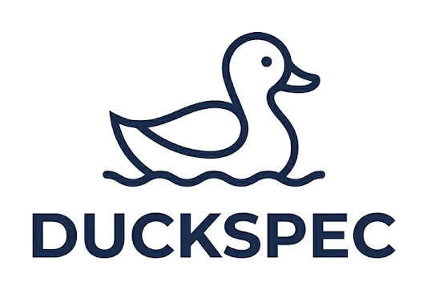

# duckspec



A spec-driven development framework for building complex projects with AI.

## How it works

1. Define your project's vocabulary as YAML `@Term` files — each term carries properties, guidelines, and AI directives
2. Load them into context with `ducktools load` (CLI) or as an MCP server
3. The AI knows your domain, follows your rules, and executes `@Recipe` instructions on demand — no re-explaining every session

## Concepts

| Concept | What it is |
|---|---|
| `@Term` | A named element of your project vocabulary; one `.yaml` file per term |
| `extends` | Inheritance — a term inherits all properties and recipes from its parent |
| `@Recipe` | Named instructions the AI executes; called with `Invoke @TermName#recipe()` |
| `@DuckArch` | Built-in terms for describing software: `@Software`, `@Function`, `@Server`, `@Script`… |
| `DuckTools` | CLI and MCP server that loads terms into the AI's context |

## Example

`WeatherWidget.yaml` — the filename is the term's identity; `@WeatherWidget` resolves against it.

```yaml
description: Minimal web app showing current weather at the user's location via IP geolocation.
extends: @Software
platform: Python
components:
  - id: server
    type: @Server
    src: server.py
    description: Python HTTP server; serves ui.html at GET / and exposes GET /weather
    functions:
      - id: get_weather
        description: >
          Gets the client IP from the request; calls http://ip-api.com/json/<ip> to resolve latitude, longitude, and city;
          calls https://api.open-meteo.com/v1/forecast?latitude=<lat>&longitude=<lon>&current=temperature_2m,weathercode;
          maps weathercode to a condition string
          (0=Clear, 1-3=Partly cloudy, 45-48=Fog, 51-67=Rain, 71-77=Snow, 80-82=Showers, 95-99=Thunderstorm);
          returns {"temperature": <°C float>, "condition": <string>, "city": <string>}
  - id: ui
    type: @UserInterface
    src: ui.html
    views:
      - id: main
        type: @View
        components:
          - id: refresh_button
            type: @Button
            label: Refresh
            signals:
              - id: clicked
                description: Emitted when the user clicks the button
          - id: weather_display
            type: @View
            description: Hidden until first data load
            components:
              - id: city_label
                type: @Label
                description: Displays the city name
              - id: temperature_label
                type: @Label
                description: Displays the temperature in °C
              - id: condition_label
                type: @Label
                description: Displays the weather condition string
    functions:
      - id: request_weather
        signal: refresh_button#clicked
        description: Calls server#get_weather via GET /weather; on success calls show_weather; on error displays "Failed to load weather"
      - id: show_weather
        description: Populates weather_display with city, temperature, and condition from the server response
```

`refresh_clicked` → `request_weather` → `GET /weather` → `server#get_weather` → ip-api + Open-Meteo → `show_weather`

## Goals

- Standardize how requirements and @Term definitions are written across projects
- Reduce the noise models introduce into the development process
- Provide tools for describing and navigating project structure
- Simplify repetitive development tasks

## Commands

Every command takes a project: either a path to its `.yaml`, or the identifier of a project
registered in your workspace — so they work from any directory. `ducktools help` prints this
reference from the tool itself, and `ducktools help <command>` details one command's arguments.

**Reading**

```sh
ducktools load-project Duckspec              # start here: root file, term list, recipes, rules
ducktools list-terms Duckspec                # every reachable term with its description
ducktools load-terms Duckspec DuckToolsApp   # one term and its transitive dependencies
ducktools resolve-path Duckspec DuckspecProject#validate   # one element, nothing else
ducktools grep Duckspec resolver             # search across term content
```

**Understanding structure**

```sh
ducktools schema Duckspec PublicKey          # every member, tagged with the ancestor declaring it
ducktools uses Duckspec File                 # who extends it, types by it, references it
ducktools query Duckspec --rootless          # terms declaring no extends
ducktools query Duckspec --extending Software
ducktools entries Duckspec DuckToolsApp#tests
```

**Checking**

```sh
ducktools verify-project Duckspec            # exits 1 on any error — usable as a CI gate
```

Finds dangling and ambiguous references, unknown or cyclic `extends`, duplicate or unparseable
terms, members shadowing an inherited one, and entries setting fields no type declares. It checks
that what is written is true and consistent — not that everything was written.

**Editing**

```sh
ducktools set Duckspec ElementState#when description "..."
ducktools remove Duckspec ElementState#when#probe
```

Both address the element by `#`-path and refuse an ambiguous one, so an edit cannot land on
whichever element happened to come first.

**Workspace**

```sh
ducktools list-projects
ducktools add-project ./MyProject.yaml
ducktools create-workspace side-project
ducktools use-workspace side-project
```

## Installation

Copy and send to your AI assistant:

> Install duckspec in this project: https://github.com/komorebinator/duckspec/blob/main/Duckspec.yaml
